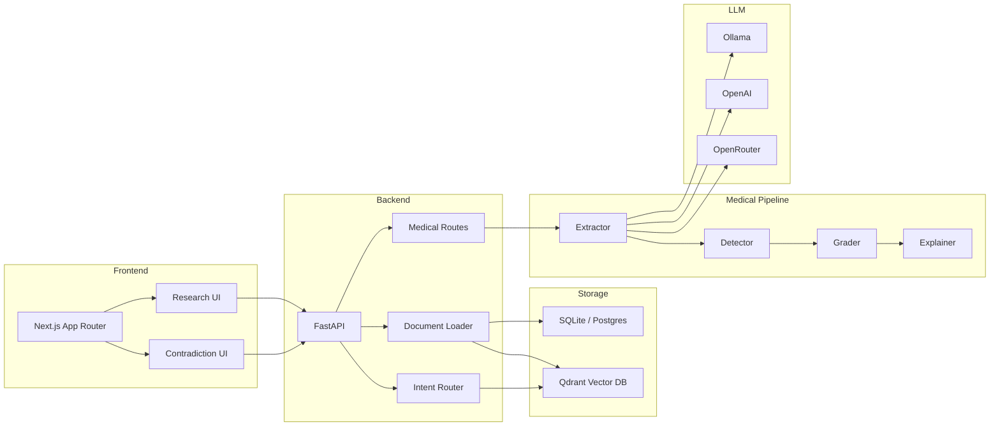

# CiteMind

CiteMind is a citation-first AI research assistant that combines document Q&A with **MedContradict** — a medical literature contradiction detection engine. Upload papers, ask questions with cited answers, and automatically detect when studies reach conflicting conclusions.

## Live Demo

- App: https://citemind-six.vercel.app
- Status: https://citemind-six.vercel.app/status
- Health: https://citemind-six.vercel.app/api/health

## Screenshots


## Features

### Research Assistant
- Upload PDF, EPUB, Markdown, or text documents
- Ask questions with inline citations and source chunks
- Generate summaries, study notes, flashcards, comparisons, and definitions
- Section-title lookups and first-mention retrieval
- Optional FlashRank reranking and LlamaParse PDF extraction
- Faithfulness, relevance, and citation coverage evaluation

### MedContradict — Contradiction Detection
- **Claim extraction** — LLM-powered extraction of drug, condition, direction, study type, sample size, and effect size from medical papers
- **Contradiction detection** — pairwise comparison across documents for opposing findings on the same drug–condition pair
- **GRADE evidence grading** — meta-analysis (5) > RCT (4) > cohort (3) > case-control (2) > case series (1), with sample-size bonus
- **Contradiction types** — DIRECT, METHODOLOGICAL, PARTIAL, TEMPORAL
- **Severity scoring** — HIGH (RCT/meta-analysis involved), MEDIUM, LOW
- **LLM explanations** — per-contradiction reasoning for why studies diverge
- **Consensus generation** — evidence-weighted summary per drug–condition pair
- **Dark-theme UI** — side-by-side claim cards, evidence bars, severity badges, expandable explanations

## Architecture



### Components

| Layer | Stack |
|-------|-------|
| Frontend | Next.js 16, React, TypeScript, Tailwind CSS v4 |
| Backend | FastAPI, SQLAlchemy, Pydantic |
| Embeddings | BGE-M3 via sentence-transformers (1024-dim) |
| Vector DB | Qdrant |
| LLM | Ollama → OpenAI → OpenRouter fallback chain |
| Storage | SQLite (local), Postgres (hosted) |

## Quick Start

### Prerequisites

- Python 3.9+
- Node.js 18+
- Docker (for Qdrant + Ollama)

### Setup

```bash
# Clone
git clone https://github.com/vivekvx/CiteMind.git
cd CiteMind

# Backend
cd backend
python3 -m venv .venv
source .venv/bin/activate
pip install -r ../requirements.txt

# Frontend
cd ../frontend
npm install

# Infrastructure
cd ..
docker compose up qdrant ollama -d

# Run
./dev.sh
```

Local URLs:
- Frontend: `http://localhost:3001`
- Backend docs: `http://localhost:8001/docs`

### Docker

```bash
docker compose up --build
```

## Configuration

Copy `.env.example` to `.env`:

```bash
cp .env.example .env
```

Key settings:

| Variable | Default | Description |
|----------|---------|-------------|
| `LLM_PROVIDER` | `auto` | `auto`, `ollama`, `openai`, or `openrouter` |
| `OLLAMA_BASE_URL` | `http://localhost:11434` | Local Ollama endpoint |
| `OLLAMA_MODEL` | `llama3.2` | Ollama model name |
| `OPENAI_API_KEY` | — | OpenAI API key |
| `OPENROUTER_API_KEY` | — | OpenRouter API key |
| `DATABASE_URL` | `sqlite:///./citemind.db` | SQLAlchemy connection string |
| `QDRANT_URL` | `http://localhost:6333` | Qdrant vector DB endpoint |
| `RETRIEVAL_MODE` | `vector` | `vector` or `page_index` |
| `RERANKER_MODE` | `none` | `none` or `flashrank` |
| `DOCUMENT_PARSER` | `markitdown` | `markitdown`, `pymupdf`, or `llama_parse` |

For frontend, create `frontend/.env.local`:

```bash
NEXT_PUBLIC_API_URL=http://localhost:8001
```

## LLM Providers

The LLM client tries providers in order: Ollama → OpenAI → OpenRouter. Set `LLM_PROVIDER` to force a specific one.

**OpenRouter:**
```bash
LLM_PROVIDER=openrouter
OPENROUTER_API_KEY=<key>
```

**OpenAI:**
```bash
LLM_PROVIDER=openai
OPENAI_API_KEY=<key>
OPENAI_CHAT_MODEL=gpt-4o-mini
```

**Local Ollama:**
```bash
LLM_PROVIDER=ollama
OLLAMA_BASE_URL=http://localhost:11434
OLLAMA_MODEL=llama3.2
```

## API

### Documents & Research
| Method | Endpoint | Description |
|--------|----------|-------------|
| `GET` | `/health` | Health check |
| `GET` | `/health/llm` | LLM provider status |
| `POST` | `/documents/upload` | Upload document |
| `GET` | `/documents` | List documents |
| `DELETE` | `/documents/{id}` | Delete document |
| `POST` | `/query` | Ask question with citations |
| `POST` | `/evals/run` | Run evaluation |

### MedContradict
| Method | Endpoint | Description |
|--------|----------|-------------|
| `POST` | `/medical/extract/{doc_id}` | Extract claims from document |
| `GET` | `/medical/claims/{doc_id}` | Get claims for document |
| `POST` | `/medical/analyze` | Run contradiction analysis |
| `GET` | `/medical/analysis/{job_id}` | Get analysis results |
| `POST` | `/medical/explain/{id}` | Explain a contradiction |

## Testing

```bash
# Unit tests
backend/.venv/bin/python -m pytest tests/medical/

# TypeScript check
cd frontend && npx tsc --noEmit

# End-to-end eval
bash scripts/demo_medcontradict.sh
```

The eval script uploads fixture papers (statin RCT vs cohort, metformin meta-analysis), runs extraction and contradiction detection, and reports precision/recall against ground truth.

## Deployment

**Vercel:**
- Frontend: `https://citemind-six.vercel.app`
- Backend: `https://citemind-api.vercel.app`

Set `NEXT_PUBLIC_API_URL=/api` and `BACKEND_API_URL=<backend-url>` for Vercel. The frontend rewrites `/api/*` to the backend service.

For hosted persistence, set `DATABASE_URL` to a Postgres connection string.

## Project Structure

```
backend/app/
├── core/           # Config, rate limiting
├── db/             # SQLAlchemy setup
├── models/         # ORM models (Document, MedicalClaim, Contradiction, AnalysisJob)
├── routes/         # FastAPI routers (documents, chat, eval, medical)
├── services/       # Embeddings, vector store, document loader, chunker, LLM client
├── schemas/        # Pydantic schemas
└── medical/        # MedContradict module
    ├── extractor.py    # Claim extraction from chunks
    ├── detector.py     # Pairwise contradiction detection
    ├── grader.py       # GRADE evidence scoring
    ├── explainer.py    # LLM explanation + consensus
    ├── prompts.py      # Prompt templates
    └── schemas.py      # ClaimOut, ContradictionOut, ContradictionReport

frontend/
├── app/
│   ├── contradictions/  # MedContradict analysis page
│   └── ...              # Research pages
├── components/
│   └── medical/         # EvidenceBar, ContradictionCard, DocumentSelector
└── lib/
    └── medical-api.ts   # Typed API client
```

## License

See [LICENSE](LICENSE).
