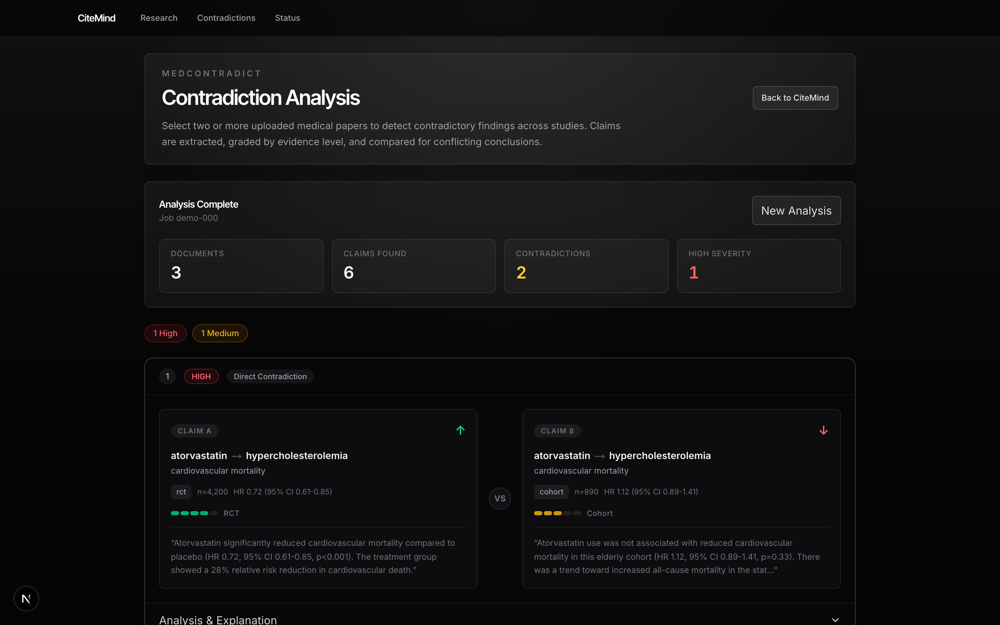
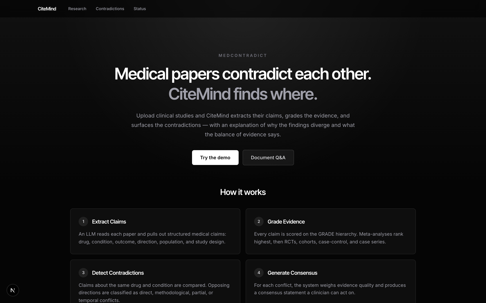
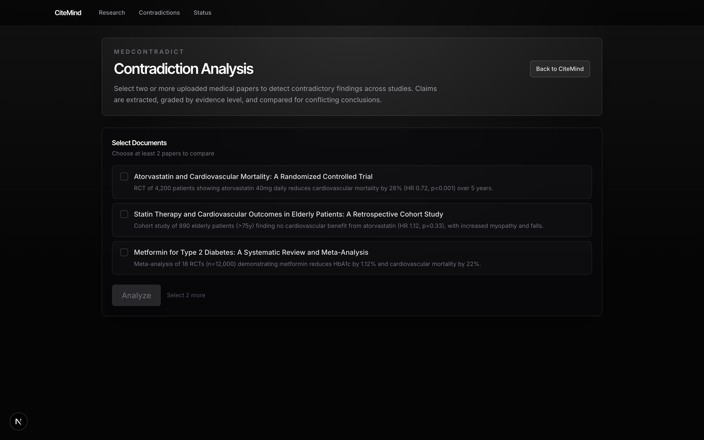
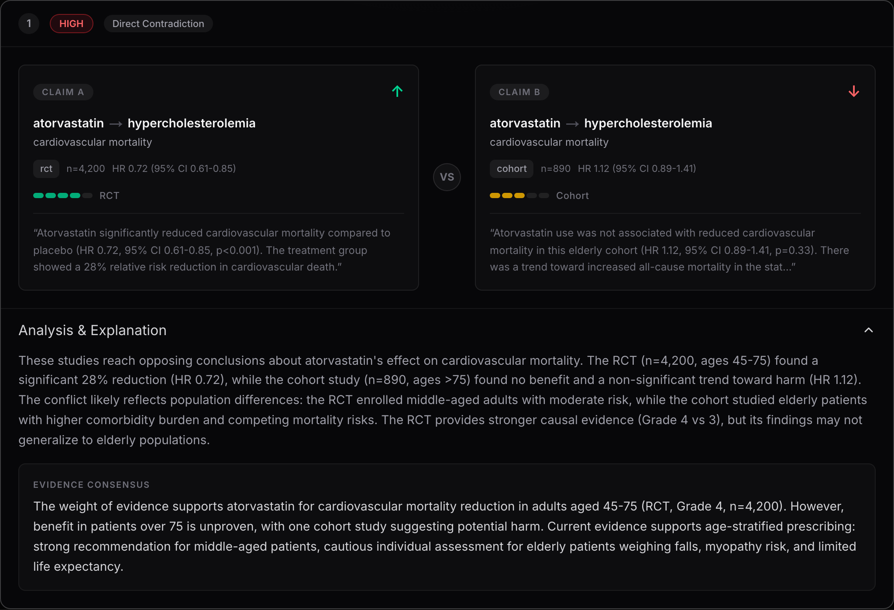
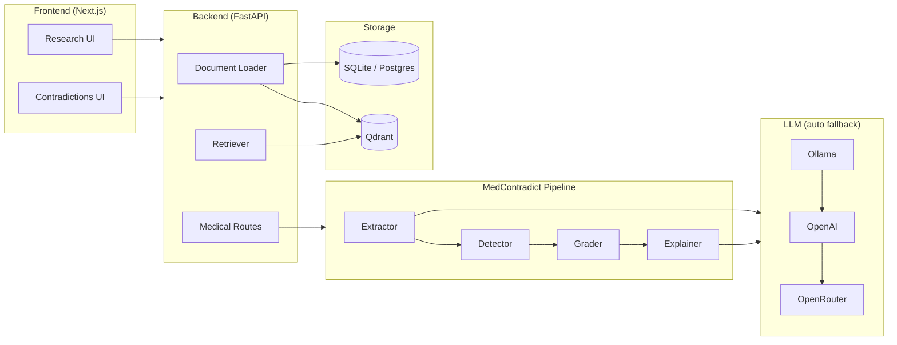

# CiteMind

> **Medical papers contradict each other. CiteMind finds where.**

[](https://www.python.org/)
[](https://fastapi.tiangolo.com/)
[](https://nextjs.org/)
[](LICENSE)

A 4,200-patient RCT says atorvastatin cuts cardiovascular mortality by 28%. A cohort of 890 elderly patients says it doesn't help and causes more myopathy. Same drug, same condition, opposite conclusions. CiteMind extracts claims from uploaded studies, grades the evidence on the GRADE hierarchy, flags the contradiction, and explains the population difference driving it.

**[Live Demo](https://citemind-six.vercel.app)** — runs on built-in sample papers, no backend needed · [API Docs](https://citemind-api.vercel.app/docs)



<details>
<summary>More screenshots</summary>

**Landing**


**Document selection**


**Contradiction detail with explanation**


</details>

---

## What It Does

### MedContradict — Contradiction Detection

Automatically detects when uploaded studies reach conflicting conclusions about the same drug–condition pair.

```
Upload papers → Extract claims → Detect contradictions → Grade evidence → Explain → Consensus
```

| Step | What happens |
|------|-------------|
| **Extract** | LLM pulls drug, condition, direction, study type, n, effect size from each chunk |
| **Detect** | Pairwise comparison flags opposing directions on the same drug–condition pair |
| **Grade** | GRADE score: meta-analysis (5) › RCT (4) › cohort (3) › case-control (2) › case series (1) |
| **Explain** | LLM reasons why the studies diverged (population, methodology, bias) |
| **Consensus** | Evidence-weighted summary across all claims for a drug–condition pair |

Contradiction types: `DIRECT` · `METHODOLOGICAL` · `PARTIAL` · `TEMPORAL`
Severity: `HIGH` (RCT or meta-analysis involved) · `MEDIUM` · `LOW`

### Research Assistant

Upload PDFs, EPUBs, Markdown, or plain text — then ask questions that return cited answers with visible source chunks. Built for auditability: every claim traces back to the document it came from.

- Inline citations with retrieved chunk display
- Section-title lookups and first-mention retrieval
- Optional FlashRank reranking for hard context lookups
- Optional LlamaParse for complex PDF extraction
- Evaluation cards: faithfulness, relevance, citation coverage

---

## Architecture



**Stack:**

| Layer | Technology |
|-------|-----------|
| Frontend | Next.js 16, TypeScript, Tailwind CSS v4 |
| Backend | FastAPI, SQLAlchemy, Pydantic |
| Embeddings | BGE-M3 via sentence-transformers (1024-dim) |
| Vector DB | Qdrant |
| LLM | Ollama → OpenAI → OpenRouter (auto fallback) |
| Storage | SQLite (local) · Postgres (hosted) |

---

## Quick Start

**Prerequisites:** Python 3.9+, Node.js 18+, Docker

```bash
git clone https://github.com/vivekvx/CiteMind.git
cd CiteMind

# Backend
python3 -m venv backend/.venv
source backend/.venv/bin/activate
pip install -r requirements.txt

# Frontend
cd frontend && npm install && cd ..

# Infrastructure (Qdrant + Ollama)
docker compose up qdrant ollama -d

# Start everything
./dev.sh
```

| URL | Purpose |
|-----|---------|
| `http://localhost:3001` | Frontend |
| `http://localhost:8001/docs` | API docs (Swagger) |
| `http://localhost:6333/dashboard` | Qdrant dashboard |

**Docker (all-in-one):**
```bash
docker compose up --build
```

---

## Configuration

```bash
cp .env.example .env
```

**Key variables:**

| Variable | Default | Notes |
|----------|---------|-------|
| `LLM_PROVIDER` | `auto` | `auto` · `ollama` · `openai` · `openrouter` |
| `OLLAMA_MODEL` | `llama3.2` | Any model pulled in Ollama |
| `OPENAI_API_KEY` | — | Required if using OpenAI |
| `OPENROUTER_API_KEY` | — | Required if using OpenRouter |
| `DATABASE_URL` | `sqlite:///./citemind.db` | Postgres URL for hosted deploy |
| `QDRANT_URL` | `http://localhost:6333` | Qdrant endpoint |
| `RETRIEVAL_MODE` | `vector` | `vector` or `page_index` |
| `RERANKER_MODE` | `none` | `none` or `flashrank` |
| `DOCUMENT_PARSER` | `markitdown` | `markitdown` · `pymupdf` · `llama_parse` |

Frontend local dev (`frontend/.env.local`):
```
NEXT_PUBLIC_API_URL=http://localhost:8001
```

### LLM Provider Examples

<details>
<summary>OpenRouter (recommended for hosted)</summary>

```bash
LLM_PROVIDER=openrouter
OPENROUTER_API_KEY=sk-or-...
LLM_CHAT_MODEL=openrouter/auto
```
</details>

<details>
<summary>OpenAI</summary>

```bash
LLM_PROVIDER=openai
OPENAI_API_KEY=sk-...
OPENAI_CHAT_MODEL=gpt-4o-mini
```
</details>

<details>
<summary>Local Ollama</summary>

```bash
LLM_PROVIDER=ollama
OLLAMA_BASE_URL=http://localhost:11434
OLLAMA_MODEL=llama3.2
```
</details>

---

## API Reference

### Documents & Research

| Method | Endpoint | Description |
|--------|----------|-------------|
| `GET` | `/health` | Service health |
| `GET` | `/health/llm` | LLM provider status |
| `POST` | `/documents/upload` | Upload document (PDF/EPUB/MD/TXT) |
| `GET` | `/documents` | List uploaded documents |
| `DELETE` | `/documents/{id}` | Delete document and chunks |
| `POST` | `/query` | Ask question, get cited answer |
| `POST` | `/evals/run` | Run RAG evaluation |

### MedContradict

| Method | Endpoint | Description |
|--------|----------|-------------|
| `POST` | `/medical/extract/{doc_id}` | Extract claims (idempotent) |
| `GET` | `/medical/claims/{doc_id}` | List claims for document |
| `POST` | `/medical/analyze` | Run contradiction analysis across docs |
| `GET` | `/medical/analysis/{job_id}` | Fetch analysis results |
| `POST` | `/medical/explain/{id}` | Generate explanation for contradiction |

---

## Testing

```bash
# Unit tests (grader, detector, extractor)
backend/.venv/bin/python -m pytest tests/medical/ -v

# TypeScript type check
cd frontend && npx tsc --noEmit

# End-to-end eval against fixture papers
bash scripts/demo_medcontradict.sh
```

The eval script uploads three synthetic papers (atorvastatin RCT, atorvastatin cohort, metformin meta-analysis), runs the full pipeline, and reports precision/recall against ground truth contradictions.

---

## Deployment

Deployed on Vercel with a split frontend + backend setup:

| Service | URL |
|---------|-----|
| Frontend | `https://citemind-six.vercel.app` |
| Backend | `https://citemind-api.vercel.app` |

The frontend rewrites `/api/*` to the backend, so all browser traffic stays on one domain.

**Vercel env vars:**
```bash
NEXT_PUBLIC_API_URL=/api
BACKEND_API_URL=https://citemind-api.vercel.app
DATABASE_URL=postgresql://...   # required for persistence
```

---

## Project Structure

```
CiteMind/
├── backend/app/
│   ├── core/           config, rate limiting
│   ├── db/             SQLAlchemy setup
│   ├── models/         Document, MedicalClaim, Contradiction, AnalysisJob
│   ├── routes/         documents, chat, eval, medical
│   ├── services/       embeddings, vector_store, chunker, llm_client
│   ├── schemas/        Pydantic I/O schemas
│   └── medical/        MedContradict module
│       ├── extractor.py    claim extraction from chunks
│       ├── detector.py     pairwise contradiction detection
│       ├── grader.py       GRADE evidence scoring
│       ├── explainer.py    LLM explanation + consensus
│       ├── prompts.py      prompt templates
│       └── schemas.py      ClaimOut, ContradictionOut, ContradictionReport
├── frontend/
│   ├── app/
│   │   ├── contradictions/ MedContradict UI page
│   │   └── ...             research pages
│   ├── components/medical/ EvidenceBar, ContradictionCard, DocumentSelector
│   └── lib/medical-api.ts  typed API client
├── tests/
│   ├── medical/            unit tests (grader, detector, extractor)
│   └── fixtures/medical/   synthetic paper fixtures
└── scripts/
    ├── eval_medcontradict.py   precision/recall eval script
    └── demo_medcontradict.sh   one-command demo
```

---

## License

[MIT](LICENSE)
